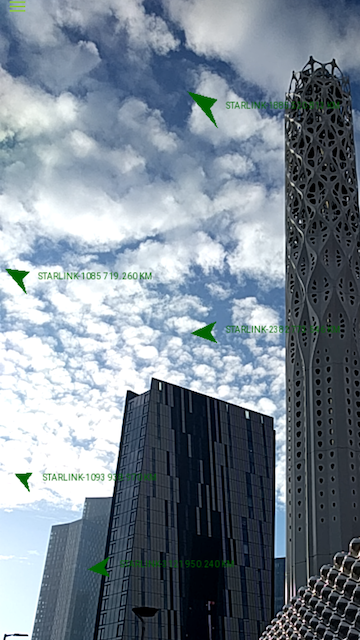
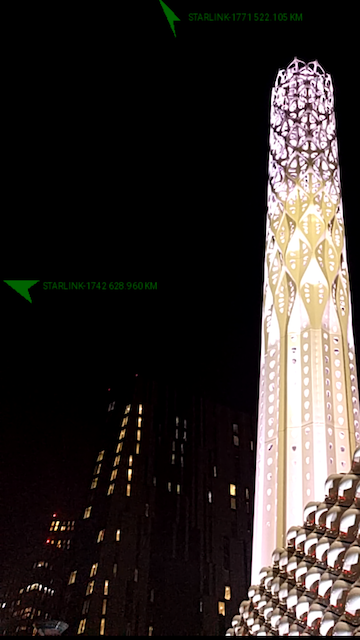

# Star Trak PWA

## A Starlink 3D tracker Progressive Web App powered by WebAssembly.

### Use any of the following links to see it in action:

1. https://star-trak.web.app
1. https://mnahad.github.io/star-trak-pwa

## Want to know where Starlink satellites are right now? `Space View` renders their 3D positions in real time.


## Want to know what's overhead? `Observer View` overlays satellite positions and headings on top of the camera.






# Quickstart

## Prerequisites

- [`node`](https://nodejs.org/)
- [`go`](https://go.dev/) for building reference CORS proxy server (optional)

## Prebuild

```sh
git submodule update --init --recursive
npm ci
npx wasm-pack build star-trak -- --features js-api
```

## Serve locally

```sh
npx ng serve
```
```sh
# If CORS proxy server is required, then in another terminal run the following:
go run proxy/main.go
```

## Build for deployment

```typescript
// Change the "gpUrl" value in src/environments/environment.prod.ts

export const environment = {
  // ...
  gpUrl: // ... The URL for the CORS proxy server
};
```

```sh
npx ng build --prod
```

# FAQ

## How does it work?

The app fetches the latest Starlink constellation General Perturbations (GP) dataset.

It then periodically runs all the state computations and coordinate transformations on-device via the [`star-trak`](https://github.com/mnahad/star-trak) WebAssembly package.

## What data does it need?

It fetches the GP dataset once at startup.

For the observer view, the app requests certain sensor data from the browser:

1. Camera image feed
1. Orientation data (including magnetometer)
1. Geolocation

The app notes the magnetometer's reading of magnetic North, so that in case the readings are no longer available it can attempt to continue orienting the overlay.

If for some reason the device geolocation cannot be read anymore, then it defaults to the last known location.

## Does the data stay on device?

Yes.

## What other packages does it use?

- [`angular`](`https://angular.io/`) is used as the frontend framework.

- [`three`](https://www.npmjs.com/package/three) is used to render the 3D objects, both in `Space View` and `Observer View`.

## Why is a CORS proxy server required?

The Starlink constellation dataset is fetched from a non-CORS server. In order to read the data, CORS needs to be explicitly allowed. A reference CORS proxy server implementation in Go is provided [here](proxy).

# Image Attributions

- Earth Observing System Project Science Office, NASA Goddard Space Flight Center
- Scientific Visualization Studio, NASA Goddard Space Flight Center
- Earth Science and Remote Sensing Unit, NASA Johnson Space Center

# Disclaimer

    For educational purposes only. STARLINK is a trademark of Space Exploration Technologies Corp. This application is not affiliated with STARLINK.
